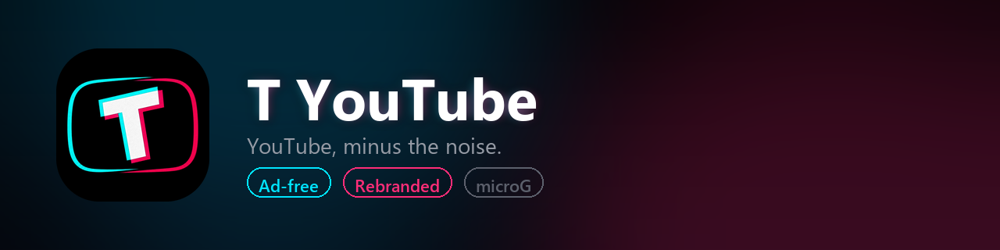
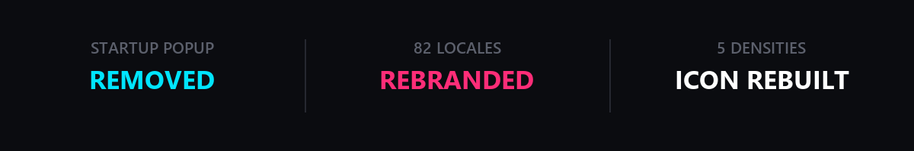
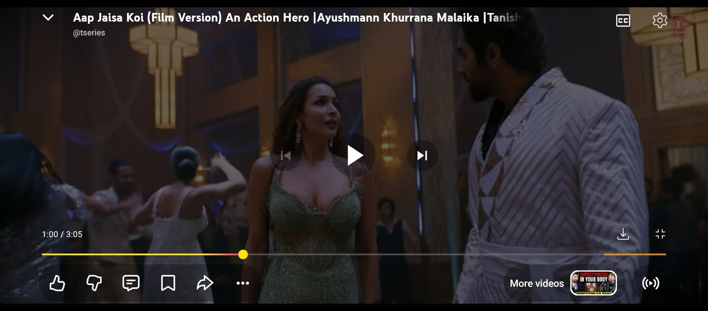
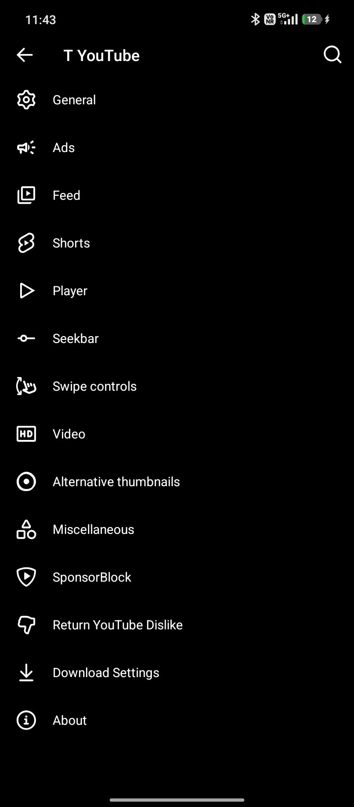
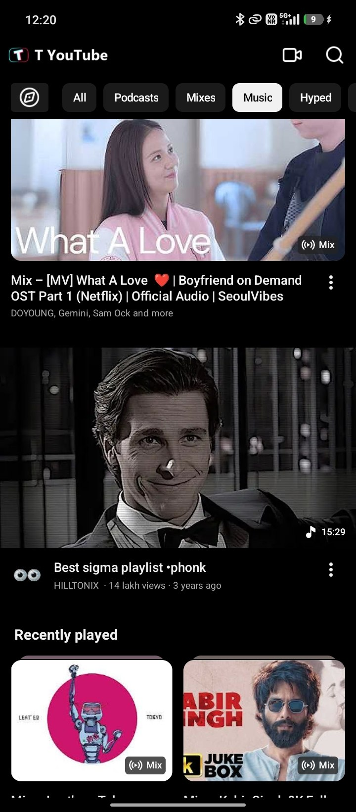
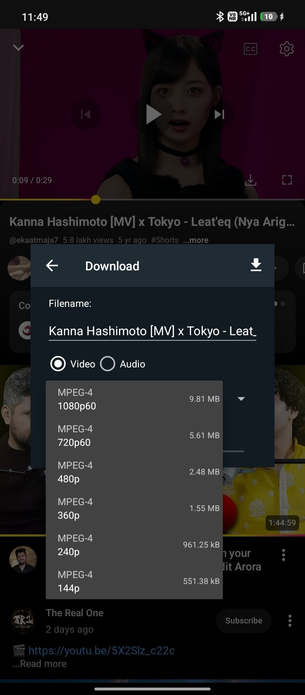
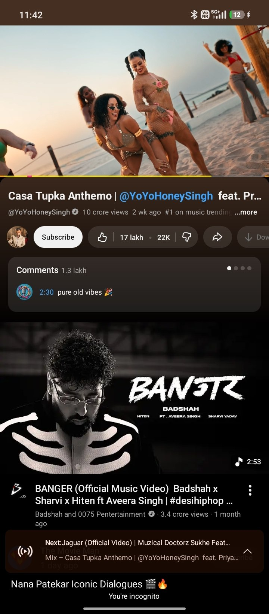

<div align="center">

  

  ### 📦 Download

**① microG-RE first** — then **② T YouTube**. Both buttons go straight to the file.

  <a href="https://github.com/MorpheApp/MicroG-RE/releases/download/7.2.1/microg-7.2.1.apk">
    
  </a>

  <a href="https://github.com/engrtarun/T-YouTube/releases/download/v1.0.0/T-YouTube-v1.0.0.apk">
    
  </a>

  <br>
  <sub>
    <b>⚠️ Install order matters:</b> microG-RE <b>pehle</b>, phir T YouTube.<br>
    Android will ask you to allow <b>"Install unknown apps"</b> for your browser the first time.<br>
    T YouTube will not run without it — it cannot use Google Play Services.
  </sub>

  <br><br>

  [](https://github.com/engrtarun/T-YouTube/releases/latest)
  [](https://github.com/engrtarun/T-YouTube/releases)
  [](https://developer.android.com/)
  [](https://github.com/engrtarun/T-YouTube/releases/latest)
  [](https://github.com/MorpheApp/MicroG-RE)
  [](#-contributing)

  <sub>
    <a href="https://github.com/engrtarun/T-YouTube/releases/tag/v1.0.0">Release notes &amp; checksums</a>
  </sub>

</div>

## 📹 Install Tutorial

**New here and just want it working?** Watch the screen recording, follow the
step-by-step, and check what each screen should look like.

<div align="center">
  <a href="https://engrtarun.github.io/T-YouTube/">
    
  </a>
</div>

<sub>› video · step-by-step · screenshots · troubleshooting · one-click downloads</sub>

---



---

## 📸 Screenshots

**Player** — one frame that shows three working features at once: the download
button, SponsorBlock, and Return-YouTube-Dislike.



**The rebrand, caught in the act** — both of these were taken on the v1.0.0
build, and both headers read **T YouTube**. On the base build this spot said
*"YouTube Pro"*, because the old name was baked into the app's header images.

<table>
<tr>
<td align="center" width="50%">
  
  <br><sub><b>Settings</b><br>Toolbar reads <b>T YouTube</b>;<br>the whole YT Pro patch menu is intact.</sub>
</td>
<td align="center" width="50%">
  
  <br><sub><b>Music tab</b><br>Rebuilt in-app wordmark —<br>T logo + “T YouTube” in the header.</sub>
</td>
</tr>
<tr>
<td align="center" width="50%">
  
  <br><sub><b>Downloader</b><br>Quality picker, 144p → 1080p60.</sub>
</td>
<td align="center" width="50%">
  
  <br><sub><b>Watch screen</b><br>Playback, comments,<br>music player.</sub>
</td>
</tr>
</table>

---

## ✨ What this build changes

This is **not** a feature-addition fork. It is a *cleanup and rebrand* of
**YT Pro v59** — three deliberate changes, nothing else.

| # | Change | Details |
|:-:|:--|:--|
| 1 | 🧹 **Startup ad/promo popup removed** | The mod fetches a remote JSON from a third-party server and pops an affiliate/promo dialog on every launch. Both code paths are stubbed to `return-void` at the entry point — no network request, no dialog, no background thread. |
| 2 | ✏️ **Full rebrand** | Every `YouTube Pro` string replaced with `T YouTube` across **all 82 locales**, plus settings screens and the launcher label — **and** the in-app wordmark images (40 PNG/WebP assets across five densities) where the old name was baked into *pixels*, which no text search can find. Zero occurrences remain. |
| 3 | 🎨 **New icon set** | Purpose-built launcher icon built to the official Android adaptive-icon spec. |

**Not changed:** the package name, version code, or any patch/feature logic.
This build upgrades in place over the original and keeps your data, logins and
watch history.

---

## 🎨 The icon

The previous icon was drawn at ~82 dp wide on a 108 dp canvas. Android only ever
shows a **72 dp** window of that canvas — so the neon ring was clipped by every
launcher mask. It looked broken.

This one is built to spec:

```
Canvas          108 dp
Masked window    72 dp   ← what the launcher actually shows
Safe zone        66 dp   ← artwork is fitted inside this circle, always
```

Built and previewed against circle, squircle and rounded-square masks at all
five densities (`mdpi` → `xxxhdpi`), plus the legacy square bitmap and the
Android 13+ **themed icon** (previously still showing the YouTube play glyph).

---

## 📋 Requirements

| | |
|:--|:--|
| **Android** | 10.0 (API 29) or newer |
| **Architecture** | `arm64-v8a`, `armeabi-v7a`, `x86`, `x86_64` — universal APK |
| **Google Play Services** | ❌ **Not required — and must not be active.** T YouTube runs on **microG-RE**, which cannot coexist with Google Play Services. |
| **microG-RE** | ✅ **Required.** A GmsCore fork — see below. |
| **Free storage** | ~350 MB (app + data) |

---

## 📥 Installation

### Step 1 — Install microG-RE first

microG-RE is a **GmsCore fork** that supplies the Google Play Services APIs
YouTube needs. T YouTube declares these in its manifest, and microG reads them
to grant the app its identity:

```
app.revanced.android.gms.SPOOFED_PACKAGE_NAME      = com.google.android.youtube
app.revanced.android.gms.SPOOFED_PACKAGE_SIGNATURE = 24bb24c0…
```

Grab it with the **①** button above, or from the official releases — never from
a random APK site:

> **https://github.com/MorpheApp/MicroG-RE/releases/latest**
>
> The **universal** `microg-*.apk` (≈107 MB) works on every phone — that's what
> the button gives you. Slimmer per-ABI builds (`-arm64-v8a`, `-armeabi-v7a`,
> ≈42 MB) are also there if you want to save data.
>
> microG-RE is **Apache-2.0** licensed and this repo links to it rather than
> re-hosting it.

> ⚠️ Already using **Google Play Services**? It must be **disabled/uninstalled**
> first. microG will not install alongside it, and T YouTube will not work while
> Play Services is still active.

### Step 2 — Enable signature spoofing

```
microG-RE Settings → Signature spoofing → enable for T YouTube
```

Without this the app installs but sign-in, playback and most API calls fail.

### Step 3 — Install T YouTube

1. Download `T-YouTube-v1.0.0.apk` from the link at the top
2. Open it — allow **"Install unknown apps"** for your file manager/browser
3. Tap **Install**

---

## ⚠️ Upgrading from an older YT Pro build

Android refuses to install an update signed with a **different key**. T YouTube
is signed with the same AOSP `testkey` certificate that YT Pro v59 uses, so it
installs **directly over** it — no uninstall, your data stays.

```
package        com.gold.android.youtube
versionCode    2147483647
signature      SHA-256  a40da80a59d170caa950cf15c18c454d47a39b26989d8b640ecd745ba71bf5dc
```

### If you get `App not installed as package conflicts with an existing package`

That message means a **differently-signed** copy of the same package is already
installed. Common causes:

| Situation | What to do |
|:--|:--|
| A YT Pro build signed with a modder's own key | Uninstall it first (⚠️ clears app data) |
| A build signed with a random debug key | Uninstall it first |
| Any other fork of `com.gold.android.youtube` | Uninstall it first |

Reinstalling **this** build after that, and staying on this build for all future
updates, avoids the problem entirely.

---

## ❓ FAQ

<details>
<summary><b>Can it run alongside the official YouTube?</b></summary>

Yes. T YouTube uses the package `com.gold.android.youtube`, while the official
YouTube is `com.google.android.youtube`. Different packages — both can be
installed side by side. In practice though, YouTube needs microG-RE and Play
Services cannot coexist with it, so you will usually want only one.
</details>

<details>
<summary><b>Does this remove in-video ads?</b></summary>

It removes the **mod's own startup promo/affiliate popup**. In-stream
advertising is served by YouTube's servers and is a separate matter.
</details>

<details>
<summary><b>Why does it say "MicroG Not Installed"?</b></summary>

microG-RE is not running, or signature spoofing is off. Go back to
Steps 1–2 above.
</details>

<details>
<summary><b>Can I update later without losing data?</b></summary>

Yes — as long as future updates keep the same signing key, Android treats them
as an in-place update. Never re-sign with a random debug key; that is the single
most common cause of the conflict error above.
</details>

<details>
<summary><b>Why was this signed with the AOSP test key?</b></summary>

Because that is the key the original YT Pro v59 is signed with, and Android
requires a matching key to install over an existing app. The AOSP `testkey`
certificate is a publicly published test certificate from the Android Open
Source Project — it is not a secret, and it grants no special privileges.
</details>

<details>
<summary><b>Is this safe?</b></summary>

It is a modified YouTube client. It is not distributed by, affiliated with, or
endorsed by Google. See [Legal](#-legal--disclaimer).
</details>

---

## 🧪 Technical details

| Property | Value |
|:--|:--|
| Package name | `com.gold.android.youtube` |
| Version name | `21.26.364` |
| Version code | `2147483647` |
| Min SDK | 29 (Android 10) |
| Target SDK | 37 |
| APK size | 224,566,006 bytes (214 MB) |
| Entry count | 16,830 |
| Signature scheme | APK Signature Scheme **v3** |
| Signing certificate | AOSP `testkey` — `CN=Android, O=Android, L=Mountain View, ST=California, C=US` |
| Cert SHA-256 | `a40da80a59d170caa950cf15c18c454d47a39b26989d8b640ecd745ba71bf5dc` |
| Cert SHA-1 | `61ed377e85d386a8dfee6b864bd85b0bfaa5af81` |

### Verify before you install

```powershell
# signature
apksigner verify --print-certs T-YouTube-v1.0.0.apk

# checksum
Get-FileHash T-YouTube-v1.0.0.apk -Algorithm SHA256
```

**SHA-256 for v1.0.0**

```
3DD2E57BCF683B36A9A1DF8BE31AA69A2380D16E96DCA9DE5009B49221B2F005
```

---

## 🔨 How it was built

```
YT Pro v59 (original APK)
        │
        ├─ apktool 2.9.3  d  →  decode to smali + res
        │
        ├─ patch ①  com.apksam.task.DevMsg.showMessage()  → return-void
        ├─ patch ②  com.sammods4h.task.DevMsg.show()      → return-void
        │            (both are the remote-config promo dialog entry points)
        │
        ├─ patch ③  res/values*/strings.xml  →  83 files, "YouTube Pro" → "T YouTube"
        ├─ patch ④  adaptive + legacy + themed icons rebuilt to spec
        ├─ patch ⑤  in-app action-bar logo → T mark
        ├─ patch ⑥  40 wordmark PNG/WebP rebuilt (the app header still said
        │            "YouTube Pro" because that text lives inside images)
        │
        ├─ apktool 2.9.3  b  →  rebuild
        ├─ zipalign -p -f 4
        └─ apksigner sign --ks testkey.p12   (AOSP testkey, scheme v3)
```

The rebuild was verified **byte-identical across all 10 `classes*.dex` files**
versus the known-good build, confirming the runtime patches survived reassembly.

---

## 👤 Maintainer

<a href="https://github.com/engrtarun">
  
  <br>
  <b>@engrtarun</b>
</a>

---

## 🤝 Contributing

Issues and pull requests are welcome — especially translations, bug reports with
logs, and icon refinements for other launcher shapes.

Please do **not** open issues for ad-blocking or account problems; those are
server-side / microG-side concerns.

---

## ⚖️ Legal & Disclaimer

T YouTube is an **unofficial, community-made modification** of the YouTube
Android client. It is not affiliated with, endorsed by, sponsored by, or
otherwise connected to Google LLC or YouTube.

- "YouTube" is a trademark of Google LLC. The name is used here only to describe
  what this software is a modification of.
- The APK contains copyrighted Google code and is published for educational and
  interoperability purposes only.
- **No source code is provided for the YouTube client itself.** The original
  authors and copyright holders retain all rights to it.
- microG-RE is a separate project (a GmsCore fork, **Apache-2.0**) and is *not*
  bundled or redistributed here — you download it from
  [MorpheApp/MicroG-RE](https://github.com/MorpheApp/MicroG-RE).
- You are responsible for complying with the laws in your jurisdiction.

---

## 🙏 Credits

| | |
|:--|:--|
| **YT Pro v59** | The base build this is forked from — the patch set, downloader and feature work are theirs |
| **microG-RE** | The Google Play Services replacement this runs on — [MorpheApp/MicroG-RE](https://github.com/MorpheApp/MicroG-RE) |
| **apktool** | Used for decode / patch / rebuild — [iBotPeaches/Apktool](https://github.com/iBotPeaches/Apktool) |
| **Android Open Source Project** | The `testkey` signing certificate is a publicly published AOSP test certificate |
| **You** | For the bug reports and translations |

---

<div align="center">
  <sub>
    Not affiliated with Google ·
    <a href="https://github.com/engrtarun/T-YouTube/issues">Report an issue</a> ·
    <a href="https://github.com/engrtarun/T-YouTube/releases">All releases</a>
  </sub>
</div>